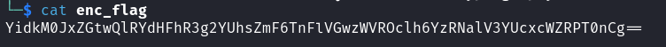
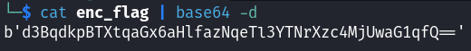
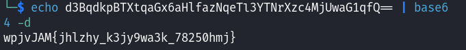
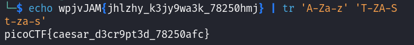

# interencdec

### Description
Can you get the real meaning from this file.

### Hints
Engaging in various decoding processes is of utmost importance

### Conhecimentos necessários:
- Base64 Encoding
- Cifra de césar

## Solução 
O arquivo **enc_flag** é fornecido, para checar seu conteúdo utilizamos o comando **cat**:

É possível perceber que a saída está codificada em **base64**, com caracteres alfanuméricos e o padding '=' no final. Para decodicar a string basta usar o comando **base64 -d**:

A saída continua sendo uma string em base64, basta repetir o mesmo processo:

Agora a string já está próxima do formato picoCTF{}, e se prestarmos atenção podemos perceber que a **cifra de césar** foi utilizada para trocar as letras. Como sabemos que a flag começa com a letra 'p' basta contar quantas letras até o 'w' faltam, subtrair do número total de letras do alfabeto, descobrir o número de letras que foram puladas na cifra de césar e aplicar o comando tr para fazer a substituição dessas letras.

p + 7 letras = w.
26 - 7 = 19.
19 representa a letra 'T' na sequência do alfabeto, logo será a letra utilizada para substituir a letra 'A' no comando tr:

 

#### Write-up por @eduardobezerraz
