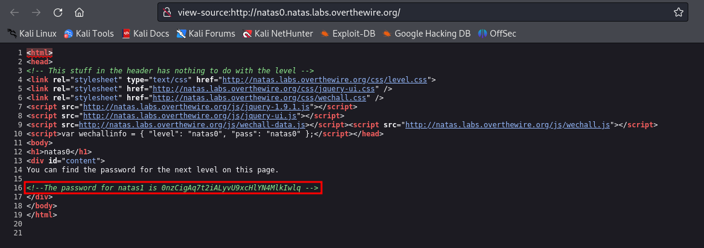

# Level 0

### Descrição
Natas ensina conceitos básicos de serverside web-security.

Cada nível do natas consiste em seu próprio site localizado em:
http://natasX.natas.labs.overthewire.org, onde X é o número do nível.

Cada nível tem acesso à senha do próximo nível. Seu trabalho é de alguma forma obter essa senha e avançar. Todas as senhas também estão armazenadas em /etc/natas_webpass/. Por exemplo, a senha do natas5 está armazenada no arquivo /etc/natas_webpass/natas5 e só pode ser lida pelos usuários natas4 e natas5.

### Credenciais do nível atual
Username: natas0
Password: natas0
URL:      http://natas0.natas.labs.overthewire.org

### Conhecimentos necessários:
- Inspecionar o código-fonte da página

## Solução 
Ao acessar a página nos deparamos com a seguinte mensagem:

A primeira coisa que vem à mente ao ver a mensagem é inspecionar o código fonte da página e procurar pela senha. Para acessar o código-fonte no firefox basta pressionar ctrl+u:

Agora basta acessar http://natas1.natas.labs.overthewire.org/ e utilizar as credenciais encontradas!

#### Write-up por @eduardobezerraz

