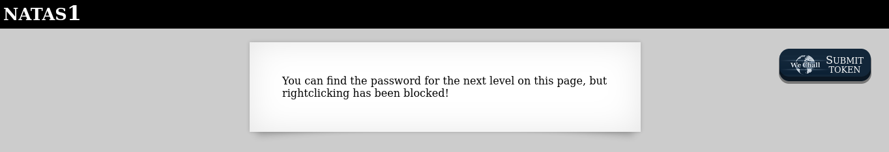
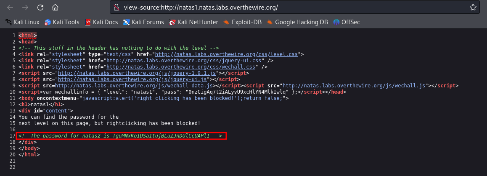

# Level 1

### Credenciais do nível atual
Username: natas1
Password: 0nzCigAq7t2iALyvU9xcHlYN4MlkIwlq
URL:      http://natas1.natas.labs.overthewire.org

### Descrição
Ao acessar a página nos deparamos com a seguinte mensagem:

### Conhecimentos necessários:
- Inspecionar o código-fonte da página

## Solução 
O clique com o botão direito está bloqueado na página, logo não é possível inspecionar o código-fonte dessa forma, porém na nível passado nós já tinhamos utilizado comando ctrl+u para ter acesso ao código, então basta fazer o mesmo.

O código-fonte da página é o seguinte:

Agora basta acessar http://natas2.natas.labs.overthewire.org/ e utilizar as credenciais encontradas na linha 17!

#### Write-up por @eduardobezerraz

