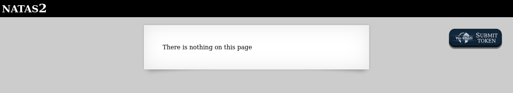
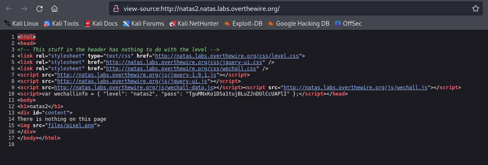
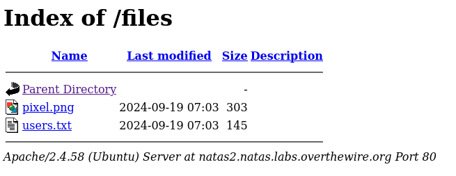
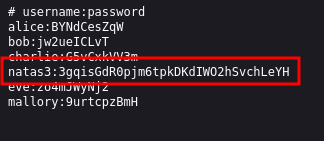

# Level 2

### Credenciais do nível atual
Username: natas2
Password: TguMNxKo1DSa1tujBLuZJnDUlCcUAPlI
URL:      http://natas2.natas.labs.overthewire.org

### Descrição
Ao acessar a página nos deparamos com a seguinte mensagem:

### Conhecimentos necessários:
- Inspecionar o código-fonte da página

## Solução 
A mensagem da página inicial nos diz que não há nada na página, então é provável que a senha para o próximo nível não esteja diretamente no código-fonte desta página. Ainda assim, iremos analisá-lo para tentar obter mais informações.

As credenciais realmente não estão presente no código-fonte, mas na linha 15 temos uma imagem "pixel.jpg" que talvez possa nos ajudar. Clicando na imagem será aberto o link view-source:http://natas2.natas.labs.overthewire.org/files/pixel.png
que também não nos dá muito informação, mas se obeservamos a URL antes da imagem existe um caminho /files, que talvez consigamos acessar.

Acessando a URL http://natas2.natas.labs.overthewire.org/files, temos a seguinte página:

Clicando no users.txt, temos:

Agora basta acessar http://natas3.natas.labs.overthewire.org/ e utilizar as credenciais encontradas!

#### Write-up por @eduardobezerraz

