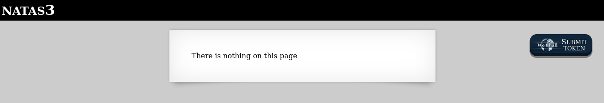
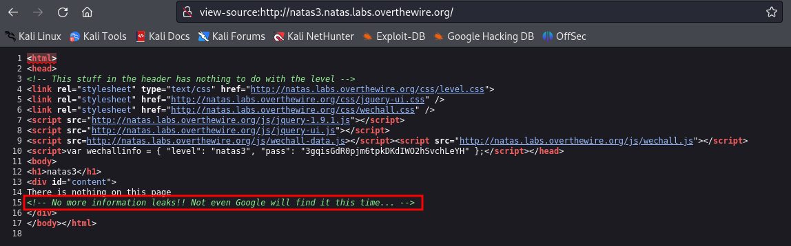
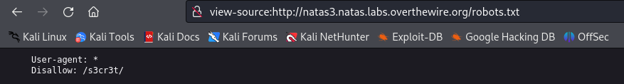
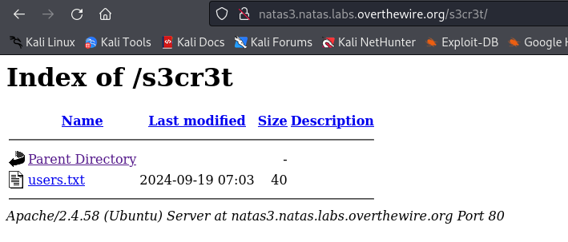
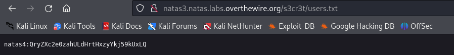

# Level 3

### Credenciais do nível atual
Username: natas3
Password: 3gqisGdR0pjm6tpkDKdIWO2hSvchLeYH
URL:      http://natas3.natas.labs.overthewire.org

### Descrição
Ao acessar a página nos deparamos com a seguinte mensagem:

### Conhecimentos necessários:
- Entender o que é o robots.txt

## Solução 
Ao analisar o código-fonte da página, nenhuma informação aparante sobre a senha é encontrada, porém na linha 15 um comentário é suspeito é
deixado.

"Nem mesmo o google vai achar dessa vez..."

Mecanismos de busca como Google, usam bots para rastrear sites e coletar informações sobre o conteúdo das páginas para exibir nos resultados de pesquisa. O arquivo robots.txt serve para configurar quais partes do domínio podem ser acessados por esses bots.

Sabendo disso, o comentário parece ser uma dica para acessar o robots.txt. 

Acessando a URL view-source:http://natas3.natas.labs.overthewire.org/robots.txt, temos:

Como dito anteriormente, o robots.txt é um arquivo que configurar quais partes do domínio bots não tem permissão de acessar. Nesse caso o /s3cr3t/ deve ser um caminho para uma URL válida.

Tentamos acessar então a URL http://natas3.natas.labs.overthewire.org/s3cr3t/ :

Clicando no users.txt:

Agora basta acessar http://natas4.natas.labs.overthewire.org/ e utilizar as credenciais encontradas!

#### Write-up por @eduardobezerraz
